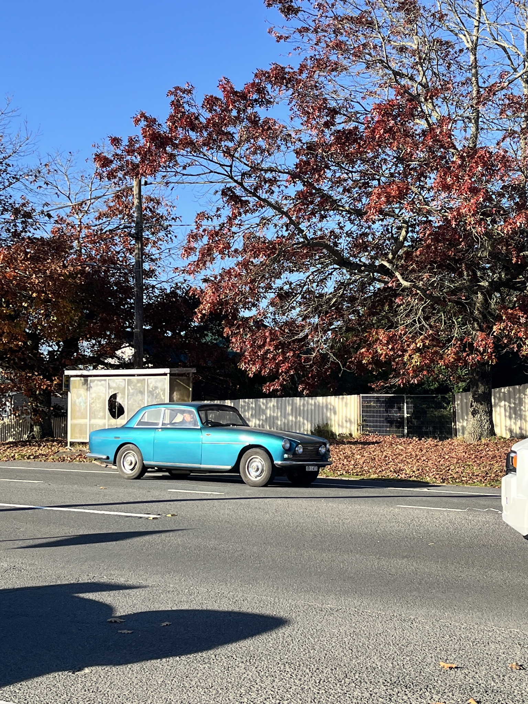

Hello! I am Dipankar, a researcher at the [UNSW-NLP](https://unswnlp.github.io/) group at [University of New South Wales](https://www.unsw.edu.au/). My research interests broadly lie in socio-culturally inclusive language technologies. 

I graduated with a Master of Information Technology with Excellence from UNSW Sydney. My masters thesis, supervised by Dr. Aditya Joshi, involved evaluating and improving dialect robustness for decoder models using adapter-based methods.

I am always open to discuss any cool ideas, so feel free to drop an email or reach out to me on X for a quick reply.  

    

---

## What have I been upto...

**2025-04**
: I presented our work titled, "Predicting the Target Word of Game-playing Conversations using a Low-Rank Dialect Adapter for Decoder Models", at proceedings of NAACL 2025.

**2025-01**
: BESSTIE: our new benchmark for sentiment and sarcasm classification for varieties of English is available on arXiv and huggingface.

**2025-01**
: Our paper titled, "Evaluating Dialect Robustness of Language Models via Conversation Understanding", is published at SUMEval Workshop @ COLING 2025.

**2024-09**
: I graduated from UNSW with a Master of Information Technology with Excellence.

**2024-05**
: I started working as a researcher at School of CSE at UNSW Sydney.

---

