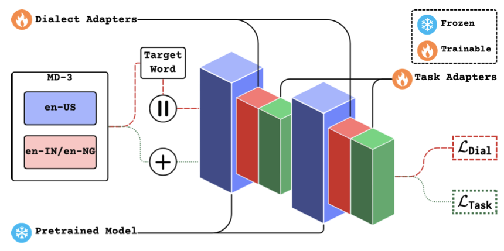

---

##### Download

+ [Paper](lordd.pdf)
+ [Code and data](https://github.com/dipankarsrirag/lordd)

---

##### Abstract

Dialect adapters that improve the performance of LLMs for NLU tasks on certain sociolects/dialects/national varieties (‘dialects’ for the sake of brevity) have been reported for encoder models. In this paper, we extend the idea of dialect adapters to decoder models in our architecture called LoRDD. Using MD-3, a publicly available dataset of word game-playing conversations between dialectal speakers, our task is Target Word Prediction (TWP) from a masked conversation. LoRDD combines task adapters and dialect adapters where the latter employ contrastive learning on pseudo-parallel conversations from MD-3. Our experiments on Indian English and Nigerian English conversations with two models (Mistral and Gemma) demonstrate that LoRDD outperforms four baselines on TWP. Additionally, it significantly reduces the performance gap with American English, narrowing it to 12% and 5.8% for word similarity, and 25% and 4.5% for accuracy, respectively. The focused contribution of LoRDD is in its promise for dialect adaptation of decoder models using TWP, a simplified version of the commonly used next-word prediction task.

---

##### Figure 2: Architecture of LoRDD



---

##### Citation

Dipankar Srirag, Aditya Joshi, and Jacob Eisenstein. 2025. [Predicting the Target Word of Game-playing Conversations using a Low-Rank Dialect Adapter for Decoder Models](https://aclanthology.org/2025.naacl-short.2/). In Proceedings of the 2025 Conference of the Nations of the Americas Chapter of the Association for Computational Linguistics: Human Language Technologies (Volume 2: Short Papers), pages 8–17, Albuquerque, New Mexico. Association for Computational Linguistics.

```BibTeX
@inproceedings{srirag-etal-2025-predicting,
    title = "Predicting the Target Word of Game-playing Conversations using a Low-Rank Dialect Adapter for Decoder Models",
    author = "Srirag, Dipankar  and
      Joshi, Aditya  and
      Eisenstein, Jacob",
    editor = "Chiruzzo, Luis  and
      Ritter, Alan  and
      Wang, Lu",
    booktitle = "Proceedings of the 2025 Conference of the Nations of the Americas Chapter of the Association for Computational Linguistics: Human Language Technologies (Volume 2: Short Papers)",
    month = apr,
    year = "2025",
    address = "Albuquerque, New Mexico",
    publisher = "Association for Computational Linguistics",
    url = "https://aclanthology.org/2025.naacl-short.2/",
    pages = "8--17",
    ISBN = "979-8-89176-190-2"
}
```

---

##### Related material

+ [Presentation slides](presentation.pdf)
+ [Oral (first 13 minutes)](https://us06web.zoom.us/rec/play/RM3KsHN7LHfPrTBB7FLVHKTpJeMz2Am5fkaiqOI34xXjbq6WQqXKZSUfN2sdaLNwHJ0JAe4jBwWSA6Vf.ttPs3-dzZRVKY4IN?accessLevel=meeting&canPlayFromShare=true&from=share_recording_detail&continueMode=true&componentName=rec-play&originRequestUrl=https%3A%2F%2Fus06web.zoom.us%2Frec%2Fshare%2FGN1R4pJU4E33Oi7a8K-gIfIAeDrVPsaE0gNyWoSFoMVQ9r-MnZL4jLwnz96Jiowp.erLpRF3aDo6kdqPY)
